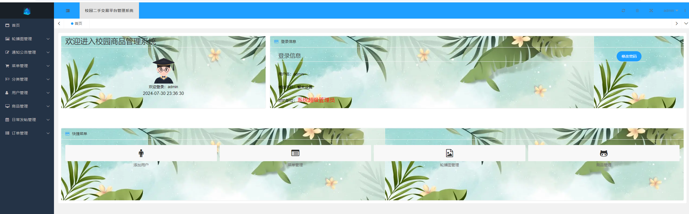

# school-market

# 介绍
### 基于微信小程序的校园二手交易平台 

功能结构图

#### 软件架构
系统分为三个端，分别是客户端、管理端、服务端；

客户端：使用原生微信小程序实现

管理端：使用Layui实现

服务端：使用Java SpringBoot实现

##### 用到的所有技术栈：
客户端：微信小程序

管理端：Html、Css、JavaScript、Layui、Ajax、JQuery

服务端：Java JDK8、SpringBoot、Mybatis

数据库：MySQL

工具：Idea、HBuilderX、微信小程序开发者工具、xampp、Navicat

#### 安装教程
1. 启动MySQL服务，新建数据库second_market，导入数据库文件second_market.sql

2. 启动服务端，在idea中打开SecondMarketServer，修改application.yml文件中的数据库连接信息，启动项目

2.  启动管理端，在HBuilderX中打开SecondMarketManager；修改AppConfig.js中的服务器信息， 配置web服务器，可以使用Nginx或者Apache，我使用xampp集成Apache；

3.  启动客户端，在微信小程序开发者工具中打开SecondMarket，修改request.js文件中的serverIp为服务端地址，修改端口号，然后启动项目

4. 测试 客户端登录、管理端登录，可以看到都可以成功登录，搭建完成

#### 效果图
客户端

管理端

#### 写在最后
所有代码以及数据库全部开源，都是我们自己写的，如果觉得有用，麻烦点个star，谢谢！
**!!! 仅用于学习交流，请勿商用或者用于违法用途！**
如果部署搭建途中有任何问题随时可以联系我，我们也可以定制开发。

邮箱：1373577355@qq.com

wx：Awake778

标签：
campus-marketplace - 校园市场

second-hand-trading - 二手交易

wechat-miniprogram - 微信小程序

spring-boot - Spring Boot

mysql-database - MySQL数据库

layui-admin - Layui管理界面

java-backend - Java后端

ecommerce-platform - 电子商务平台

community-commerce - 社区商务

opensource-project - 开源项目

system- 系统
